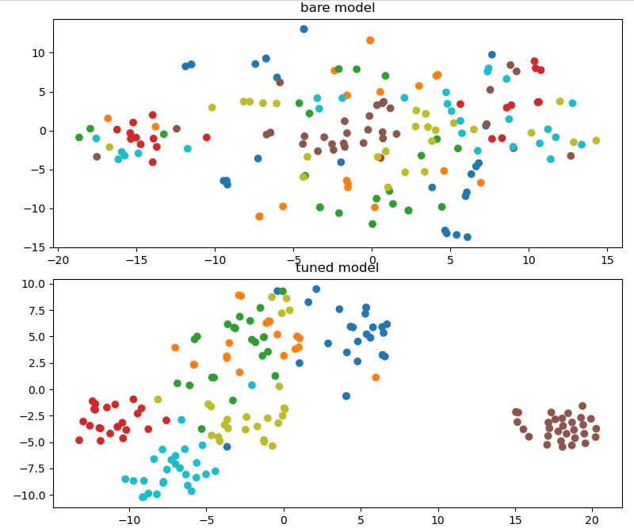
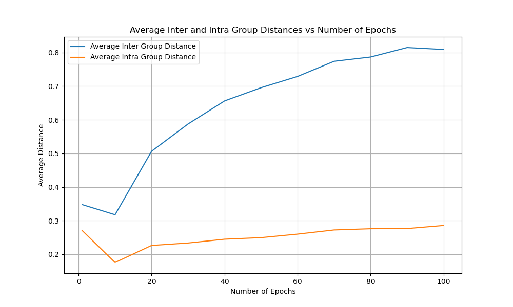
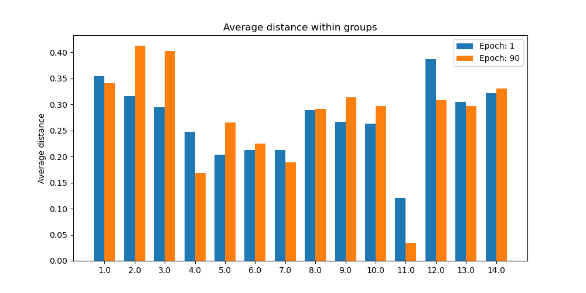
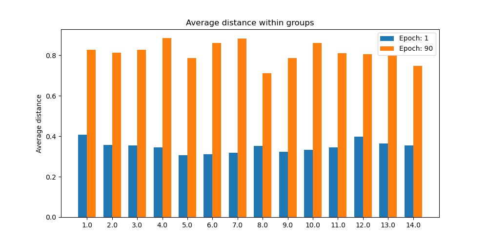

# Semantic Search with Adaptors Fine-tuning

## Training with Triplet Loss Function

### Dataset
#### Dataset before processing:
|     | question                                                  |   id |
|----:|:----------------------------------------------------------|-----:|
|  32 | القرف ده ماله                                             |    2 |
|   9 | ازيكم                                                     |    1 |
| 225 | فروعكم ف امدرمان                                          |    9 |
| 102 | اسعار العملة اليوم                                        |    4 |
| 236 | وين اراضيكم                                               |    9 |
| 104 | سعر الضولار كم                                            |    4 |
| 252 | انا في السعوديه عايز ارسل السودان بالبنك كيف              |   10 |
| 313 | اتمنى من الله الانضمام الى فريق العمل القائم خريجة محاسبة |   13 |
| 103 | كم يساوي ١٠٠٠٠جنيه مصر مقيل جنيه سوداني                   |    4 |
| 311 | بسال من وظائف البنك خريجه علوم حاسوب                      |   13 |

#### Dataset after processing:
|     | Anchor                              | Positive                                                        | Negative                                                      |
|----:|:------------------------------------|:----------------------------------------------------------------|:--------------------------------------------------------------|
| 439 | ممتاز👍شكرا ليكم                    | شكرا جزيلا وصلتكم امس واتممت معاملتي بكل يسر جزاكم الله الف خير | عندكم وظائف لو سمحتو                                          |
|  62 | ياخي انتو قرف                       | انتو ما بتخافوا ربنا و لا شنو                                   | عايز غرد اسافر ببهو                                           |
| 108 | تلفونكم 6100ماشغال عندكم تلفون تانى | الرقم مغلق                                                      | سلام انا داير افتح حساب                                       |
| 197 | شنو المطلوب عشان افتح حساب اجنبي    | بسأل من فتح حسأب عندكم بي كم                                    | بسأل من التمويل                                               |
| 126 | داير اتكلم مع زول من خدمة العملا    | الرقم مغلق                                                      | بسأل من فتح حسأب عندكم بي كم                                  |
|   4 | اهلا                                | ازيكم                                                           | أرقامكم التي بالموقع لا تعمل                                  |
|  69 | ياخي ما تجضموا شغلكم باخ            | قرف يقرفكم ياخ                                                  | كم سعر اليورو                                                 |
| 364 | كيف طريقة التحويل من السعوديه؟      | وهل ممكن ارسل واستقبل من السودان للسعودية والعكس                | الساده البنك الأهلي السوداني                                  |
| 466 | بسأل اذا كان عندكم فرص توظيف ؟      | هل عندكم فرص تدريب تريننج                                       | رقم الجوال                                                    |
|  13 | الو                                 | اهلين                                                           | سلام عليكم في طريقة تحويل من السعوديه الى بنك الاهلى السوداني |

### Training and Results:
#### Training Parameters:
| Parameter           | Value |
|:--------------------|------:|
| Model               | MiniLM-L6-v2 |
| Batch Size          | 16 |
| Epochs              | 10 |
| Warmup Steps        | 100 |
| Model Save Path     | ./TripletLoss/models/sbert_model |

#### Results:
#### STS-B Test:
| Model           | Score |
|:--------------------|------:|
| MiniLM-L6-v2 | 0.8203247283076371 |
| ./TripletLoss/models/sbert_model | 0.819612290601182 |
#### Embedding Visualization:

#### Cosine Similarity Distance Averages:

#### Cosine Similarity Distance inter-group Plot:

#### Cosine Similarity Distance intra-group Plot:

